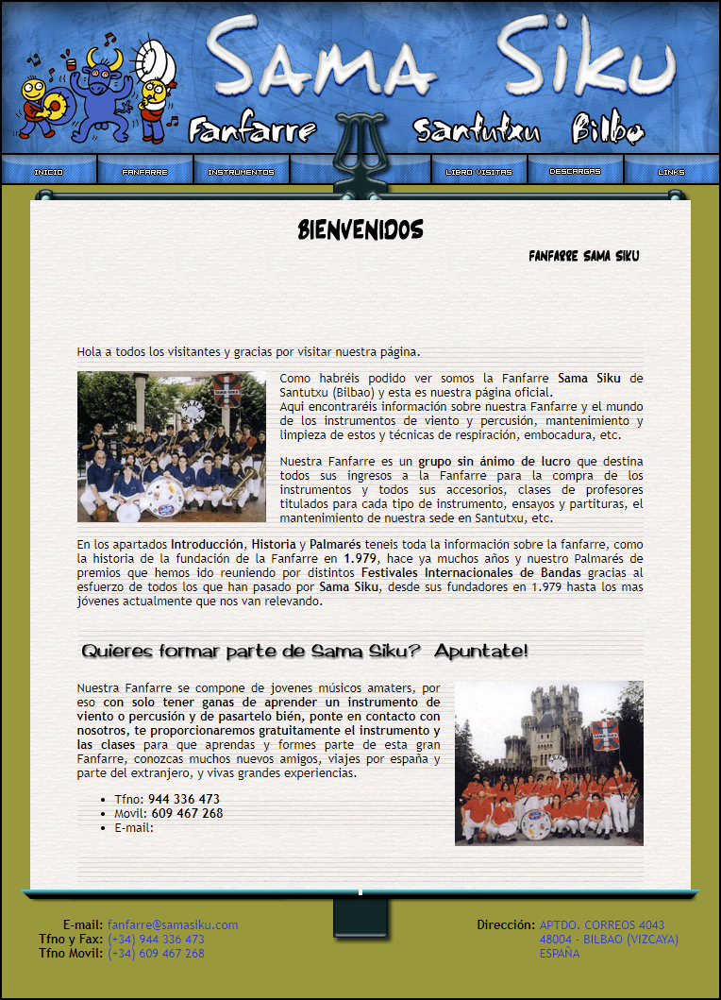

# Sama-Siku-Web-PHP
Web de la Fanfarre Sama Siku de Sanmtuxtu, Bilbao.

Esta web se hizo ya hace años, como en 2007, empezó con simple HTML y tablas y libro de visitas externo.
Y fue evolucionando hasta meter PHP y MySQL, con base de datos de los miembros de la banda, y libro de visitas en la propia base de datos.
También remarcar la ilustración de Kukuxumusu, que realizó muy amablemente para Fanfarre Sama Siku.

## Captura

